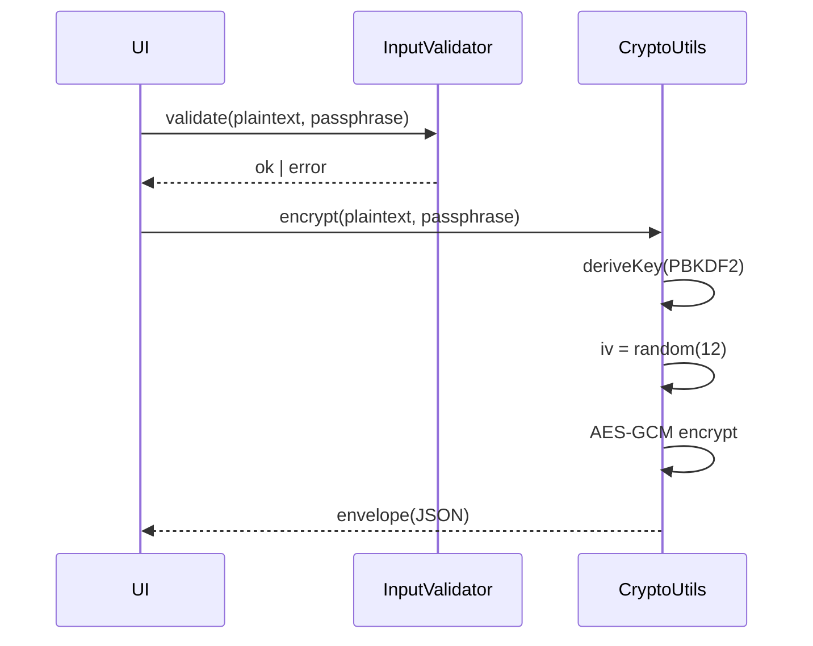
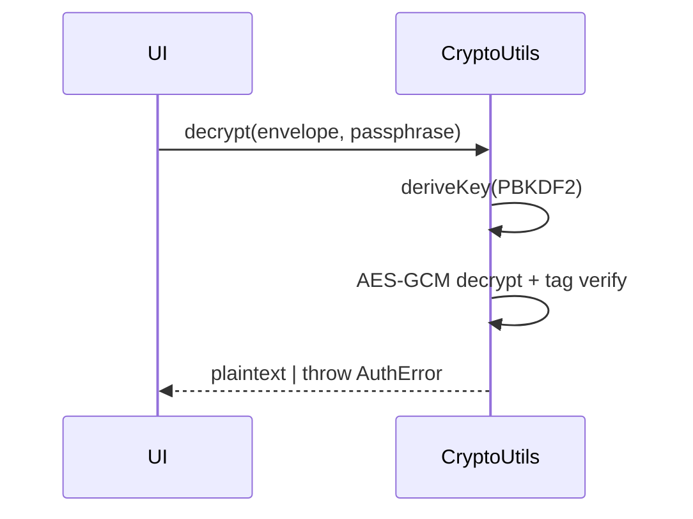

Architecture: Nexus Encryption
==============================

This document explains how the app is wired end‑to‑end: modules, flows, security posture, and the build/release pipeline. It’s meant to be clear enough for new contributors and rigorous enough for an audit.

High‑level system
-----------------

```mermaid
graph LR
  A[React 19 UI (Next.js 15)] -- user inputs --> B[InputValidator]
  A --> C[CryptoUtils]
  A --> D[ErrorHandler]
  A --> E[SecurityAuditor]
  C <--> F[SecureStore]
  F <--> G{{Tauri Commands}}
  G <--> H[(OS Keychain)]
```

Principles
----------

- **Desktop‑first security**: Tauri shell with Rust commands; small attack surface and OS keychain for secrets.
- **Least privilege**: strict allowlists in Tauri, strict CSP and security headers in Next.js.
- **Fail secure**: crypto operations authenticate data (GCM tag). Input validation rejects early. Errors are structured and severity‑ranked.
- **Test everything important**: unit, component, performance, chaos/stress.

Key modules
-----------

- `lib/crypto-utils.ts`
  - AES‑256‑GCM encrypt/decrypt, PBKDF2 derivation, CSPRNG (`getRandomValues`), key‑strength analysis, helpers (IV generation, base64 encoding, etc.).
- `lib/secure-store.ts`
  - Stores sensitive values via Tauri keychain when available; falls back to localStorage for web preview. Uniform API.
- `lib/input-validator.ts`
  - Guardrails for text, passwords, filenames; normalization and sanitization to reduce XSS and path‑traversal risk.
- `lib/error-handler.ts`
  - Central place to construct `SecurityError` objects, assign severity, and surface them to UI/telemetry.
- `lib/security-auditor.ts`
  - Runs configuration checks: headers, CSP, storage, permissions; produces a concise human‑readable report.
- `src-tauri/src/main.rs`
  - `keychain_set`, `keychain_get`, `keychain_delete` Tauri commands; bridges to OS keychain; minimal surface area.

Data model (crypto blobs)
-------------------------

All ciphertexts are self‑describing JSON envelopes so decryption doesn’t depend on out‑of‑band knowledge.

```json
{
  "version": 1,
  "alg": "AES-256-GCM",
  "kdf": { "name": "PBKDF2", "iterations": 250000, "salt": "<base64>" },
  "iv": "<base64-12-bytes>",
  "ciphertext": "<base64>",
  "authTag": "<included by GCM in ciphertext>"
}
```

Core flows
----------

Encrypt sequence
~~~~~~~~~~~~~~~~



Decrypt sequence
~~~~~~~~~~~~~~~~



Security posture
----------------

- Headers (set in `next.config.mjs`):
  - **CSP**: default‑src 'self'; script/style restrictions; object‑src 'none'; frame‑ancestors 'none'; upgrade‑insecure‑requests.
  - **HSTS** with preload; **X‑Frame‑Options** deny; **X‑Content‑Type‑Options** nosniff.
  - **Referrer‑Policy**: strict‑origin‑when‑cross‑origin.
  - **COOP/COEP/CORP** to isolate the browsing context; **Permissions‑Policy** to explicitly deny unused APIs.
- Input validation and sanitization at all UI boundaries.
- Rate limiting for sensitive/high‑cost operations.
- Secrets live in the **OS keychain** via Tauri commands.
- SBOM + OSV scanner in CI to catch dependency risks.

Threat model (abridged)
-----------------------

| Threat | Mitigation |
| --- | --- |
| XSS / DOM injection | Strict CSP, sanitized inputs, no dangerous `dangerouslySetInnerHTML` paths in app code |
| Clickjacking | `frame-ancestors 'none'`, X‑Frame‑Options deny |
| Token/secret leakage | OS keychain; no tokens in localStorage when Tauri is available |
| MITM on updates | Tauri updater signing; release signatures verified |
| Supply chain | SBOM + OSV scan, pinned dependencies |
| Brute force | Rate limiter + KDF iteration count |

Error handling
--------------

- `ErrorHandler` creates structured `SecurityError` records with `code`, `severity`, and safe messages.
- Non‑recoverable crypto errors (bad auth tags) stop the flow early and never return partial plaintext.

Performance profile
-------------------

- Crypto is browser‑native (WebCrypto) with hardware acceleration when present.
- Long‑running or heavy tests use Node workers; JSDOM constraints are documented.
- Real‑world desktop performance is substantially higher than JSDOM; stress tests reflect this.

Testing strategy
----------------

- Unit: crypto primitives, validators, utilities.
- Component: main UI and Key Generator interactions.
- Performance: timed encrypt/decrypt batches across sizes.
- Chaos: rate‑limiter abuse, malformed inputs, random failure injection.
- Stress/soak: thousands of encrypt/decrypt cycles; note JSDOM caveats.

Build and release
-----------------

1. Next.js dev server on port 3020 for the Tauri shell.
2. Tauri dev for desktop preview.
3. CI workflow builds installers, generates SBOM, runs OSV scan.
4. Optional: notarization/signing via CI secrets; Tauri updater private key managed offline.

Configuration knobs
-------------------

- PBKDF2 iterations and salt length.
- Key strength thresholds for UI hints.
- Rate limiter window and thresholds.
- CSP origins (tight by default; extend only when necessary).

Future improvements
-------------------

- Hardware‑backed keys (Secure Enclave/TPM) when available via Tauri plugins.
- Multi‑vault profiles with different policies.
- Streaming encryption for large files.

Appendix: Directory map
-----------------------

```
app/                       Next.js App Router
components/                UI components and `nexus-cipher.tsx`
hooks/                     Clipboard, theme, keyboard, virtual scroll
lib/                       Crypto, security, storage, utilities
src-tauri/                 Rust commands + Tauri config
__tests__/                 Unit, component, performance, chaos, stress
```


