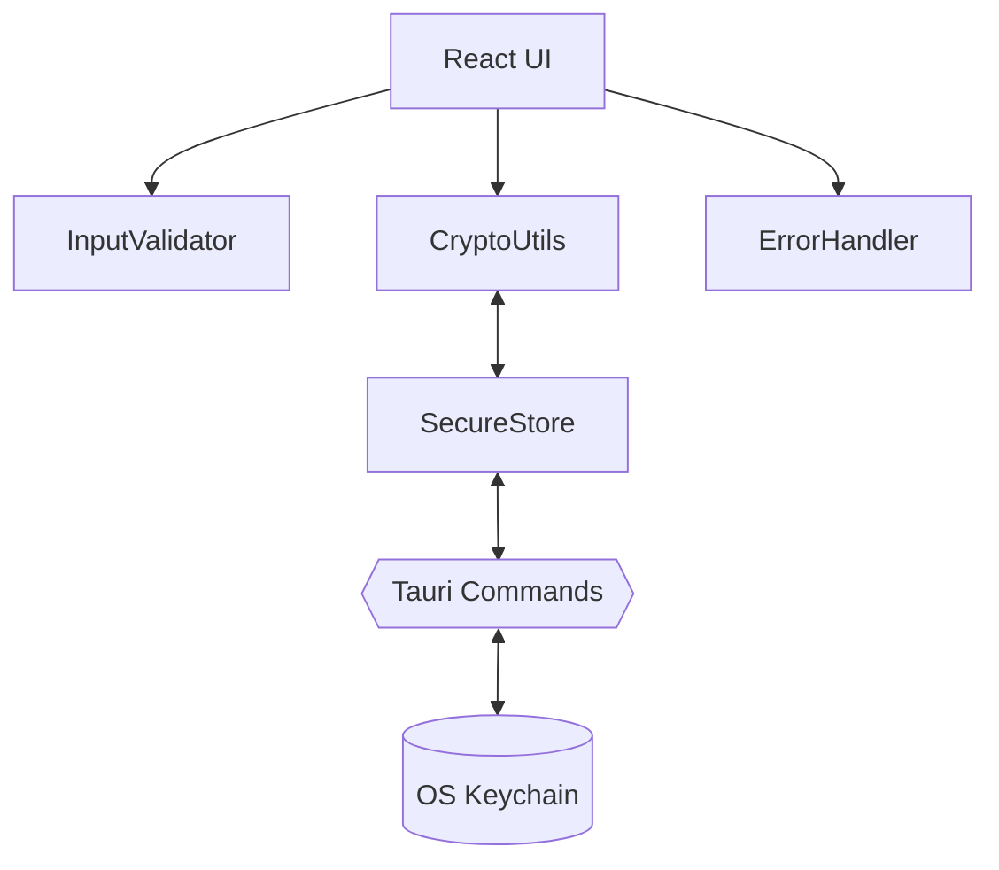
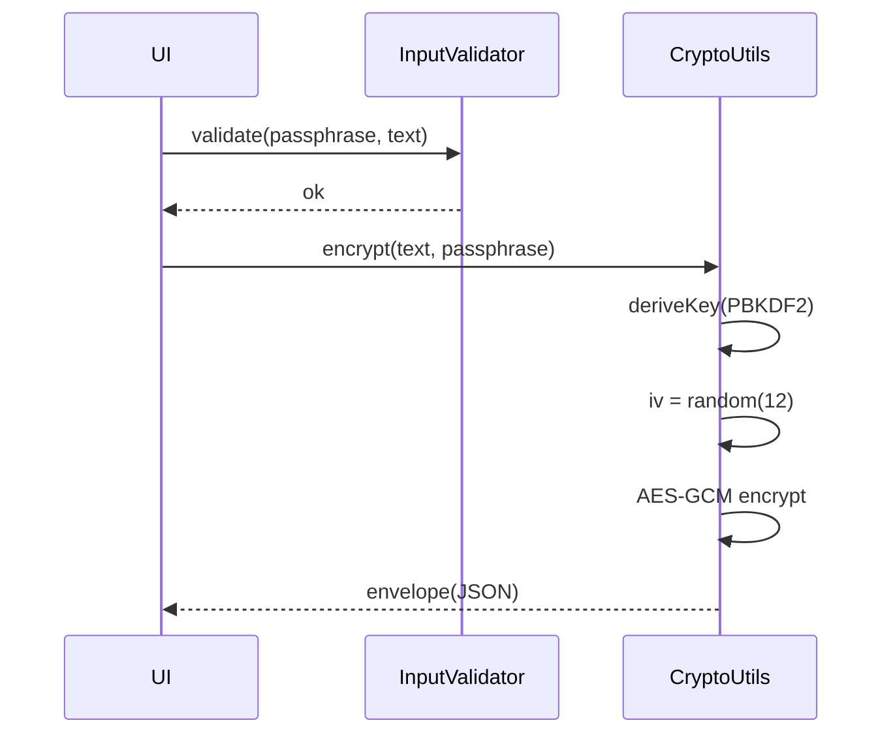

At runtime, the React UI (Next.js 15 + React 19) runs inside Tauri’s webview. A slim Rust layer exposes only the commands we need.

System map
----------

Sequence: Encrypt one message
-----------------------------

Error strategy
--------------

- Guard clauses, typed errors, and severity levels.
- Auth failures (bad GCM tag) short‑circuit with a user‑friendly message.
- Non‑fatal issues route through `ErrorHandler` and can be surfaced via a global listener.

Performance notes
-----------------

- WebCrypto is hardware‑accelerated on most platforms.
- Long‑running tests in CI use limits suitable for JSDOM; desktop runs are much faster.

