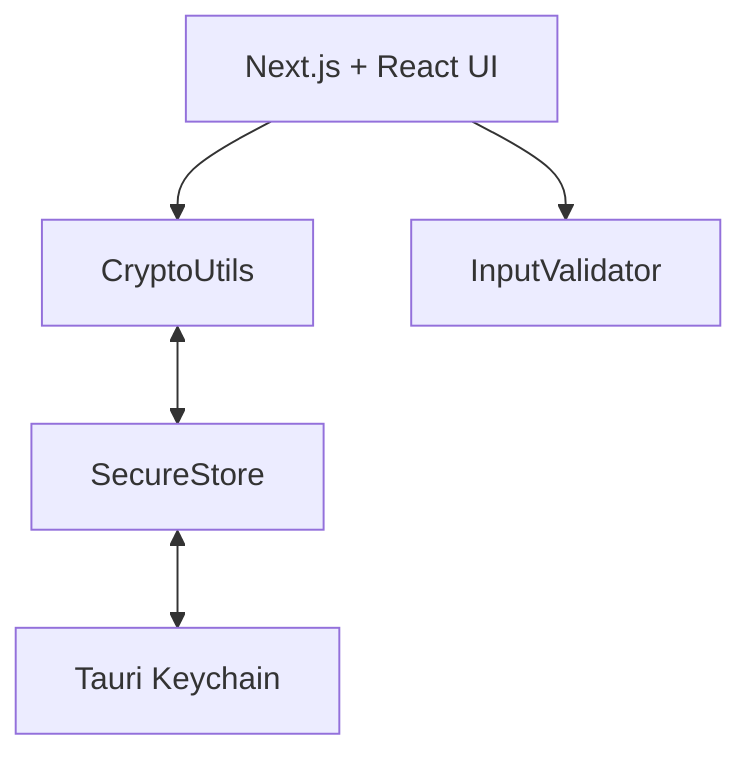

Welcome to your encryption command center. This site is the practical, slightly opinionated handbook for building, running, and shipping Nexus Encryption.

What’s inside:

- The 10,000‑ft view of how the app works
- Hands‑on guides for dev, test, release
- Security posture and the “why” behind decisions



Quick start
-----------

```bash
pnpm install
PORT=3020 pnpm dev
pnpm tauri dev
```

Production build:

```bash
pnpm tauri build
```

Where to next?

- Read the Architecture for the deep dive.
- Jump to Security when you’re in paranoia mode.


